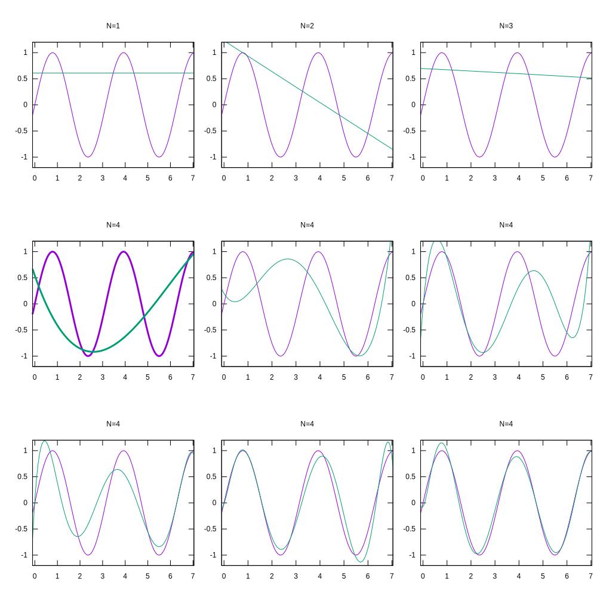

# microcheby

This is a Rust library for computing and evaluating polynomial approximations of functions of one variable using [Chebyshev polynomials](https://en.wikipedia.org/wiki/Chebyshev_polynomials). The code is `no_std` compatible, has no external dependencies and is optimized to run in environments where every clock cycle counts. Optimizations include:

* [Clenshaw recursion](https://en.wikipedia.org/wiki/Clenshaw_algorithm) for evaluating approximations.
* Efficient loop free functions for evaluating approximations of low orders.
* Even more efficient evaluation of low order approximations where the range happens to be [-1, 1]

The basic idea is to approximate a function as an infinite weighted sum of polynomials of increasing order. If the function is sufficiently smooth, the weights will typically converge to zero quickly and only the first few terms are needed to get a good approximation.

