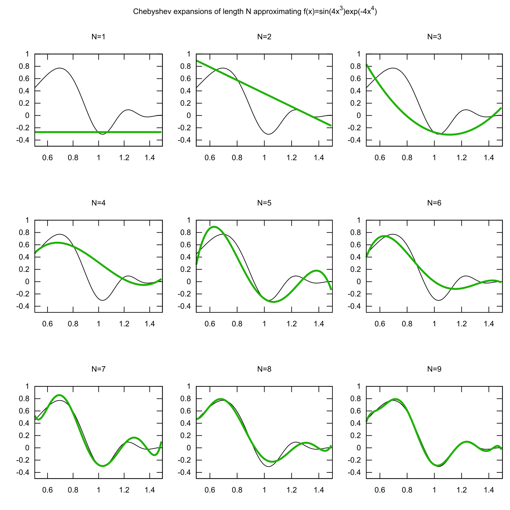

# microcheby

[](https://crates.io/crates/microcheby)
[](https://docs.rs/microcheby)

microcheby is a Rust library for computing and evaluating polynomial approximations of functions of one variable using using [Chebyshev polynomials](https://en.wikipedia.org/wiki/Chebyshev_polynomials). The code is `no_std` compatible and optimized for resource constrained environments where every clock cycle counts. Optimizations include:

* [Clenshaw recursion](https://en.wikipedia.org/wiki/Clenshaw_algorithm) for evaluating approximations.
* Efficient loop free functions for evaluating low order approximations.
* Even more efficient loop free evaluation if the range happens to be [-1, 1].
* Approximation evaluation without divisions.

# Installing

Add the following line to your Cargo.toml file:

```
microcheby = "0.1"
```

To use microcheby in a no_std environment:

```
microcheby = { version = "0.1", default-features = false }
```

# Chebychev approximation

Sufficiently well behaved functions can be expressed as an infinite weighted sum of so called [Chebyshev polynomials](https://en.wikipedia.org/wiki/Chebyshev_polynomials) of increasing order. Such a sum is known as a Chebyshev expansion. If the function is smooth enough, the coefficients (weights) will typically converge to zero quickly and only the first few terms are needed to get a good approximation. For a truncated expansion with _n_ terms, an estimate of the approximation error is given by the magnitude of coefficient _n+1_.

Below are some graphs showing how the approximation converges to the target function 
as the number of terms in the expansion increases. For smoother target functions, convergence
is generally faster.


